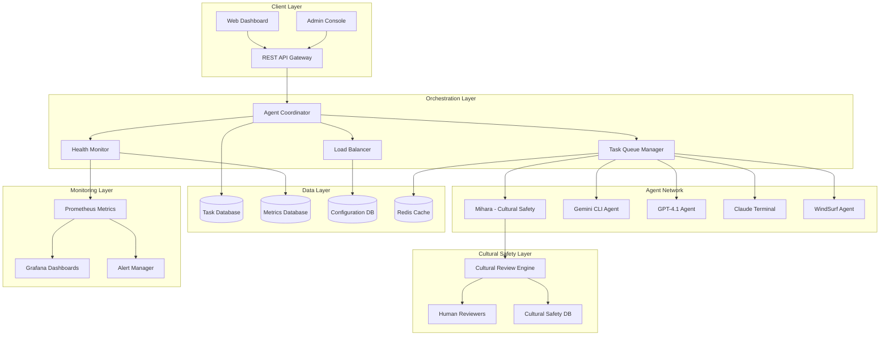
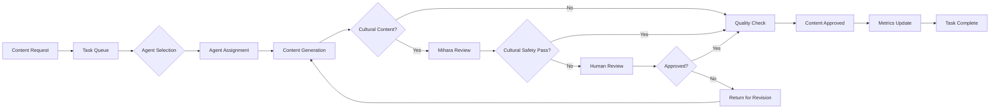
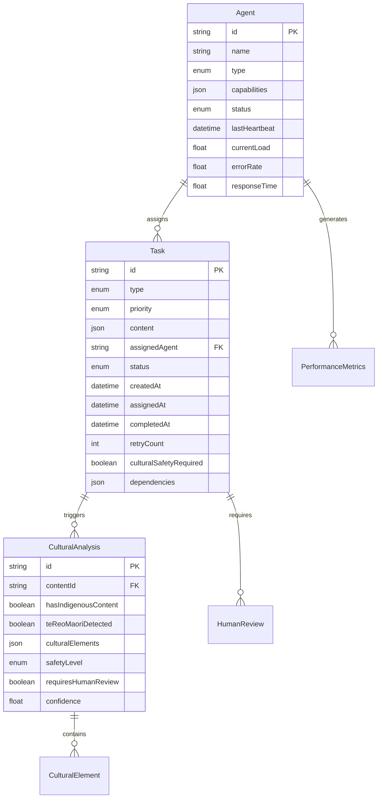
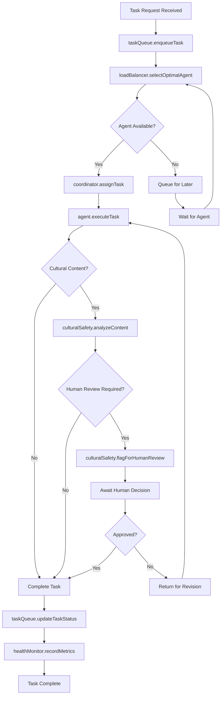
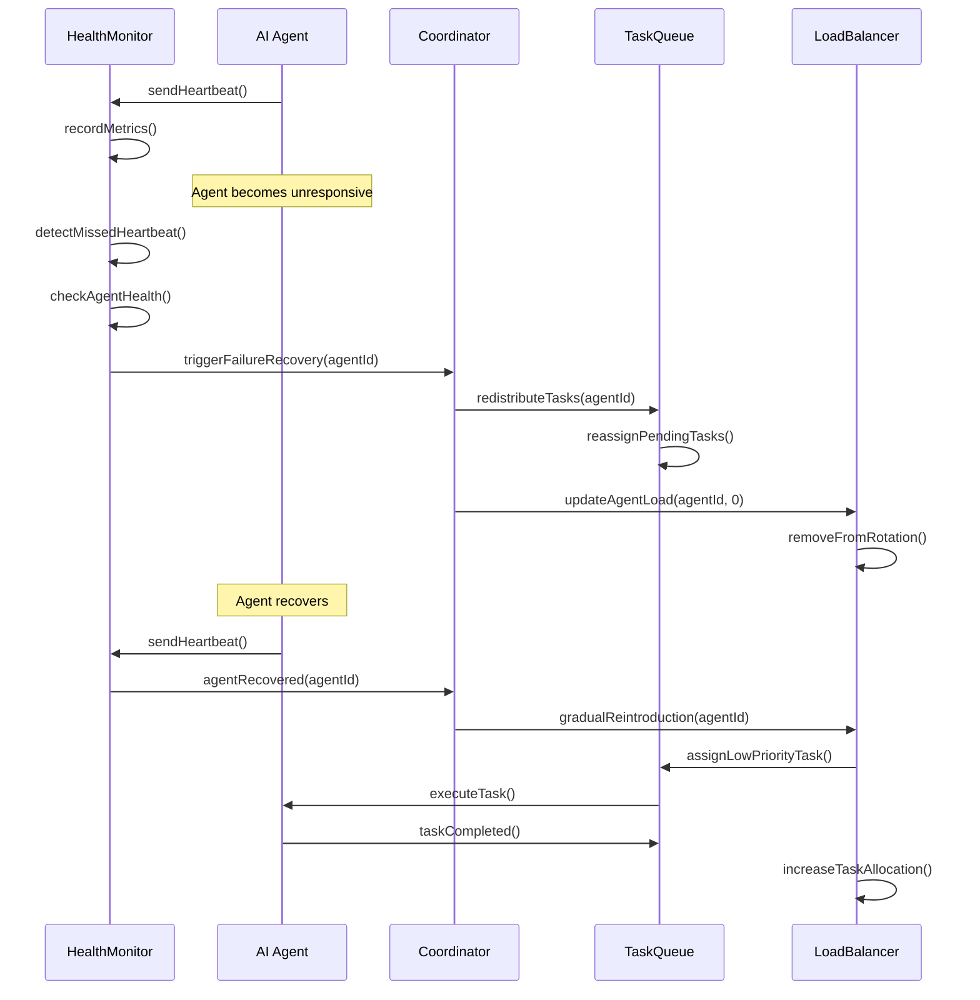
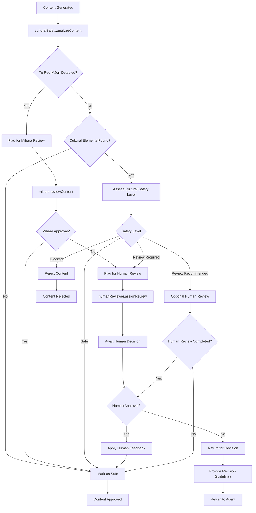

# Agent Coordination Revival System - Design Document

## Overview

The Agent Coordination Revival System is a sophisticated multi-agent orchestration platform designed to manage AI collaboration for the Great Migration project. The system coordinates multiple AI agents (Gemini CLI, GPT-4.1, Claude Terminal, and others) to achieve automated content production velocity of 100+ educational resources per day while maintaining strict cultural safety standards for Indigenous Māori content.

### Design Goals
- **High Velocity**: Achieve 100+ educational resources per day production target
- **Cultural Safety**: Automated cultural review workflows with human oversight for Māori content
- **Resilience**: Robust failure recovery and task reassignment capabilities
- **Scalability**: Dynamic agent scaling based on workload demands
- **Real-time Monitoring**: Comprehensive health monitoring and performance analytics

### Design Scope
This design covers the complete multi-agent coordination infrastructure including task distribution, health monitoring, cultural safety workflows, failure recovery, and performance analytics systems.

## Architecture Design

### System Architecture Diagram



### Data Flow Diagram



## Component Design

### Agent Coordinator

**Responsibilities:**
- Central orchestration of all agent activities
- Task distribution and load balancing
- Agent lifecycle management
- System state coordination

**Interfaces:**
```typescript
interface AgentCoordinator {
  registerAgent(agent: Agent): Promise<AgentRegistration>
  assignTask(task: Task, agent: Agent): Promise<TaskAssignment>
  handleAgentFailure(agentId: string): Promise<void>
  redistributeTasks(failedAgentId: string): Promise<void>
  getSystemStatus(): Promise<SystemStatus>
}
```

**Dependencies:**
- Task Queue Manager
- Health Monitor
- Load Balancer
- Configuration Database

### Task Queue Manager

**Responsibilities:**
- Task prioritization and queuing
- Task distribution algorithms
- Queue monitoring and optimization
- Backpressure management

**Interfaces:**
```typescript
interface TaskQueueManager {
  enqueueTask(task: Task): Promise<string>
  dequeueTask(agentCapabilities: AgentCapabilities): Promise<Task | null>
  updateTaskStatus(taskId: string, status: TaskStatus): Promise<void>
  getQueueMetrics(): Promise<QueueMetrics>
  redistributeTask(taskId: string, newAgentId: string): Promise<void>
}
```

**Dependencies:**
- Redis Cache
- Task Database
- Agent Coordinator

### Health Monitor

**Responsibilities:**
- Agent heartbeat monitoring
- Performance metrics collection
- Failure detection and alerting
- System health assessment

**Interfaces:**
```typescript
interface HealthMonitor {
  startHeartbeatMonitoring(agentId: string): Promise<void>
  recordMetrics(agentId: string, metrics: PerformanceMetrics): Promise<void>
  checkAgentHealth(agentId: string): Promise<HealthStatus>
  triggerFailureRecovery(agentId: string): Promise<void>
  getSystemHealthReport(): Promise<SystemHealthReport>
}
```

**Dependencies:**
- Metrics Database
- Prometheus
- Alert Manager

### Cultural Safety Engine

**Responsibilities:**
- Automated cultural content detection
- Māori language and content flagging
- Cultural safety workflow orchestration
- Human reviewer assignment

**Interfaces:**
```typescript
interface CulturalSafetyEngine {
  analyzeContent(content: Content): Promise<CulturalAnalysis>
  flagForHumanReview(contentId: string, reason: string): Promise<void>
  processHumanReview(reviewId: string, decision: ReviewDecision): Promise<void>
  getCulturalSafetyMetrics(): Promise<SafetyMetrics>
  updateSafetyRules(rules: SafetyRule[]): Promise<void>
}
```

**Dependencies:**
- Cultural Safety Database
- Human Review System
- Mihara Agent

### Load Balancer

**Responsibilities:**
- Agent workload distribution
- Capacity-based task routing
- Dynamic scaling decisions
- Performance optimization

**Interfaces:**
```typescript
interface LoadBalancer {
  selectOptimalAgent(task: Task, availableAgents: Agent[]): Promise<Agent>
  updateAgentLoad(agentId: string, currentLoad: number): Promise<void>
  triggerScaling(direction: ScalingDirection): Promise<void>
  getLoadMetrics(): Promise<LoadMetrics>
}
```

**Dependencies:**
- Configuration Database
- Health Monitor
- Agent Coordinator

## Data Model

### Core Data Structure Definitions

```typescript
// Agent Models
interface Agent {
  id: string
  name: string
  type: AgentType
  capabilities: AgentCapabilities
  status: AgentStatus
  lastHeartbeat: Date
  currentLoad: number
  errorRate: number
  responseTime: number
}

interface AgentCapabilities {
  contentTypes: ContentType[]
  languages: LanguageCode[]
  maxConcurrentTasks: number
  specializations: string[]
  culturalSafetyLevel: CulturalSafetyLevel
}

enum AgentStatus {
  ACTIVE = 'active',
  UNHEALTHY = 'unhealthy',
  FAILED = 'failed',
  MAINTENANCE = 'maintenance',
  SCALING = 'scaling'
}

enum AgentType {
  MIHARA = 'mihara',
  GEMINI = 'gemini',
  GPT4 = 'gpt4',
  CLAUDE = 'claude',
  WINDSURF = 'windsurf'
}

// Task Models
interface Task {
  id: string
  type: TaskType
  priority: Priority
  content: ContentRequest
  assignedAgent?: string
  status: TaskStatus
  createdAt: Date
  assignedAt?: Date
  completedAt?: Date
  retryCount: number
  culturalSafetyRequired: boolean
  dependencies: string[]
}

interface ContentRequest {
  title: string
  description: string
  targetAudience: string
  contentType: ContentType
  languageRequirements: LanguageRequirement[]
  culturalContext?: CulturalContext
  deadline: Date
}

enum TaskStatus {
  PENDING = 'pending',
  ASSIGNED = 'assigned',
  IN_PROGRESS = 'in_progress',
  CULTURAL_REVIEW = 'cultural_review',
  HUMAN_REVIEW = 'human_review',
  COMPLETED = 'completed',
  FAILED = 'failed',
  CANCELLED = 'cancelled'
}

// Cultural Safety Models
interface CulturalAnalysis {
  contentId: string
  hasIndigenousContent: boolean
  teReoMaoriDetected: boolean
  culturalElements: CulturalElement[]
  safetyLevel: CulturalSafetyLevel
  requiresHumanReview: boolean
  confidence: number
}

interface CulturalElement {
  type: CulturalElementType
  content: string
  confidence: number
  location: ContentLocation
}

enum CulturalSafetyLevel {
  SAFE = 'safe',
  REVIEW_RECOMMENDED = 'review_recommended',
  REVIEW_REQUIRED = 'review_required',
  BLOCKED = 'blocked'
}

// Performance Models
interface PerformanceMetrics {
  agentId: string
  timestamp: Date
  taskCompletionTime: number
  errorRate: number
  throughput: number
  memoryUsage: number
  cpuUsage: number
  activeConnections: number
}

interface SystemHealthReport {
  overallStatus: SystemStatus
  agentHealth: AgentHealthSummary[]
  queueStatus: QueueStatus
  culturalSafetyStatus: SafetySystemStatus
  performanceMetrics: SystemPerformanceMetrics
  alerts: Alert[]
}
```

### Data Model Diagrams



## Business Process

### Process 1: Task Assignment and Execution



### Process 2: Agent Health Monitoring and Failure Recovery



### Process 3: Cultural Safety Review Workflow



## Error Handling Strategy

### Failure Categories and Response Protocols

#### Agent Failure Handling
- **Heartbeat Timeout**: 90-second threshold triggers automatic task redistribution
- **Performance Degradation**: Gradual load reduction when response times exceed 10 seconds
- **High Error Rate**: Automatic task throttling when error rate exceeds 5%
- **Complete Failure**: Immediate task reassignment and agent quarantine

#### Task Failure Recovery
- **Single Agent Failure**: Automatic reassignment to next available capable agent
- **Multi-Agent Failure**: Escalation to human intervention after 3 failed attempts
- **Cultural Safety Failure**: Immediate flagging and human review requirement
- **System Overload**: Automatic task queuing and load balancing activation

#### Data Consistency
- **Task State Management**: ACID transactions for critical state changes
- **Message Delivery**: At-least-once delivery guarantees with idempotency
- **Cultural Safety Audit**: Immutable audit trails for all cultural decisions
- **Metrics Integrity**: Time-series data validation and corruption detection

### Circuit Breaker Patterns
```typescript
interface CircuitBreaker {
  state: CircuitBreakerState
  failureThreshold: number
  timeoutDuration: number
  monitoredOperation: () => Promise<any>
}

enum CircuitBreakerState {
  CLOSED = 'closed',     // Normal operation
  OPEN = 'open',         // Failing fast
  HALF_OPEN = 'half_open' // Testing recovery
}
```

## Testing Strategy

### Automated Testing Framework

#### Unit Testing
- **Component Isolation**: Individual component testing with mocked dependencies
- **Interface Validation**: TypeScript interface compliance verification
- **Error Condition Coverage**: Comprehensive failure scenario testing
- **Performance Benchmarking**: Response time and throughput validation

#### Integration Testing
- **Agent Communication**: End-to-end message flow validation
- **Cultural Safety Pipeline**: Complete workflow testing with test content
- **Database Transactions**: Data consistency and rollback testing
- **API Contract Testing**: REST API specification compliance

#### Load Testing
- **Concurrent Agent Simulation**: 50+ simultaneous agent load testing
- **High-Volume Task Processing**: 100+ tasks per hour throughput validation
- **Cultural Safety Bottleneck Testing**: Human review capacity stress testing
- **Failure Recovery Validation**: Cascading failure scenario testing

#### Cultural Safety Testing
- **Te Reo Māori Content Detection**: Comprehensive language pattern testing
- **Cultural Element Recognition**: Indigenous content identification accuracy
- **False Positive Minimization**: Non-cultural content clearance validation
- **Human Review Integration**: End-to-end cultural workflow testing

### Monitoring and Observability

#### Real-time Metrics
```typescript
interface SystemMetrics {
  tasksPerHour: number
  averageCompletionTime: number
  agentUtilization: Record<string, number>
  culturalReviewBacklog: number
  systemThroughput: number
  errorRates: Record<string, number>
}
```

#### Alert Configurations
- **Critical**: System failure, agent complete outage, cultural safety violations
- **Warning**: Performance degradation, queue backup, high error rates
- **Info**: Scaling events, configuration changes, maintenance activities

#### Dashboard Views
- **Operations Dashboard**: Real-time system status and agent health
- **Performance Analytics**: Historical trends and optimization insights
- **Cultural Safety Monitor**: Review queue status and compliance metrics
- **Capacity Planning**: Resource utilization and scaling recommendations

This comprehensive design ensures the Agent Coordination Revival System can achieve its ambitious goals of 100+ resources per day while maintaining the highest standards of cultural safety and system reliability.