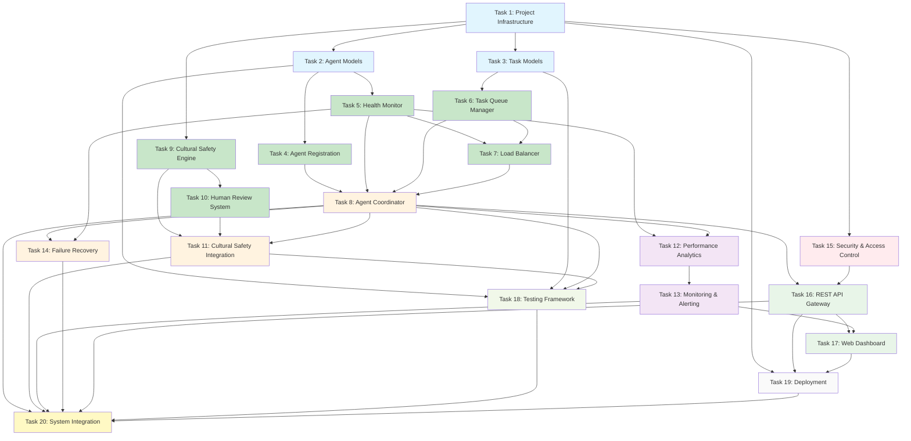

# Agent Coordination Revival System - Implementation Plan

## Overview

This implementation plan provides actionable coding tasks for building the Agent Coordination Revival System, a multi-agent orchestration platform designed to achieve 100+ educational resources per day while maintaining strict cultural safety standards.

## Implementation Tasks

- [ ] 1. Set up project infrastructure and core type definitions
  - Create TypeScript project structure with proper configuration
  - Define core interfaces for Agent, Task, HealthMonitor, and LoadBalancer components
  - Implement shared enums and type definitions for AgentStatus, TaskStatus, and CulturalSafetyLevel
  - Set up database schemas for PostgreSQL with proper indexes and constraints
  - Configure Redis for task queue and caching with appropriate data structures
  - _Requirements: 7.1, 7.3, 10.1_

- [ ] 2. Implement core Agent data models and validation
  - Create Agent model class with comprehensive validation for capabilities and status
  - Implement AgentCapabilities interface with content type and language validation
  - Write validation functions for agent registration and configuration updates
  - Create unit tests for Agent model validation and edge cases
  - _Requirements: 7.1, 7.2, 7.4_

- [ ] 3. Implement Task data models and state management
  - Create Task model class with status tracking and dependency management
  - Implement ContentRequest interface with cultural context validation
  - Write task state transition validation to ensure proper workflow progression
  - Create unit tests for task lifecycle and state management
  - _Requirements: 2.1, 2.4, 3.1, 5.4_

- [ ] 4. Build Agent Registration and Capability Management system
  - Implement AgentRegistry class for agent lifecycle management
  - Create agent onboarding workflow with capability validation and testing
  - Write agent authentication and authorization using JWT tokens
  - Implement agent configuration validation against system requirements
  - Create integration tests for agent registration and capability updates
  - _Requirements: 7.1, 7.2, 7.4, 8.1, 8.6_

- [ ] 5. Implement Health Monitor core functionality
  - Create HealthMonitor class with heartbeat tracking and performance metrics collection
  - Implement agent health assessment algorithms with configurable thresholds
  - Write failure detection logic with 90-second heartbeat timeout
  - Create performance metrics recording with CPU, memory, and response time tracking
  - Implement unit tests for health monitoring and failure detection scenarios
  - _Requirements: 1.1, 1.2, 1.3, 1.4, 1.5_

- [ ] 6. Build Task Queue Manager with distributed queuing
  - Implement TaskQueueManager class using Redis as the backing store
  - Create task prioritization algorithms considering agent capabilities and workload
  - Write task distribution logic with agent matching and load balancing
  - Implement backpressure management for queue overflow scenarios
  - Create unit tests for task queuing, dequeuing, and redistribution
  - _Requirements: 2.1, 2.2, 2.5, 5.1, 5.4_

- [ ] 7. Implement Load Balancer with intelligent agent selection
  - Create LoadBalancer class with multiple assignment strategies
  - Implement agent selection algorithms considering current load and capabilities
  - Write dynamic scaling logic for agent resource management
  - Create load metrics calculation and capacity monitoring
  - Implement unit tests for load balancing algorithms and scaling decisions
  - _Requirements: 2.1, 2.2, 2.3, 2.4, 6.2_

- [ ] 8. Build Agent Coordinator orchestration layer
  - Implement AgentCoordinator class as the central orchestration component
  - Create task assignment workflow with agent selection and load balancing integration
  - Write failure recovery protocols with automatic task redistribution
  - Implement agent lifecycle management including graceful shutdown procedures
  - Create integration tests for end-to-end task coordination workflows
  - _Requirements: 5.1, 5.2, 5.3, 5.6, 6.1, 6.6_

- [ ] 9. Implement Cultural Safety Engine core functionality
  - Create CulturalSafetyEngine class for automated content analysis
  - Implement Te Reo Māori detection algorithms using language pattern matching
  - Write cultural element identification logic for Indigenous content
  - Create safety level assessment with confidence scoring
  - Implement unit tests for cultural content detection and safety assessment
  - _Requirements: 3.1, 3.4, 3.5_

- [ ] 10. Build Human Review workflow system
  - Implement HumanReviewManager class for review assignment and tracking
  - Create reviewer assignment algorithms based on expertise and availability
  - Write review workflow state management with timeout handling
  - Implement feedback integration system for agent learning
  - Create unit tests for human review assignment and decision processing
  - _Requirements: 3.2, 3.3, 3.5, 3.6_

- [ ] 11. Implement Cultural Safety workflow integration
  - Integrate CulturalSafetyEngine with TaskQueueManager for automatic content screening
  - Create cultural safety workflow orchestration with proper state transitions
  - Write Mihara agent integration for specialized cultural review
  - Implement audit trail system for all cultural safety decisions
  - Create integration tests for complete cultural safety workflow
  - _Requirements: 3.1, 3.2, 3.3, 3.4_

- [ ] 12. Build Performance Analytics and Metrics system
  - Implement MetricsCollector class for system performance tracking
  - Create performance analytics algorithms for trend analysis and optimization
  - Write reporting system with configurable time ranges and data export
  - Implement anomaly detection for performance degradation alerts
  - Create unit tests for metrics collection and performance analysis
  - _Requirements: 4.1, 4.2, 4.3, 4.5, 9.1, 9.2, 9.6_

- [ ] 13. Implement Real-time Monitoring and Alerting
  - Create Prometheus metrics integration for system monitoring
  - Implement Grafana dashboard configuration for real-time visualization
  - Write AlertManager integration for automated incident response
  - Create system health reporting with comprehensive status assessment
  - Implement integration tests for monitoring and alerting workflows
  - _Requirements: 1.6, 4.4, 9.2_

- [ ] 14. Build failure recovery and circuit breaker patterns
  - Implement CircuitBreaker class for service resilience
  - Create failure recovery protocols with exponential backoff
  - Write automatic restart mechanisms for failed agents
  - Implement graceful degradation strategies for system overload
  - Create unit tests for failure scenarios and recovery mechanisms
  - _Requirements: 5.1, 5.2, 5.3, 5.5, 5.6_

- [ ] 15. Implement Security and Access Control system
  - Create AuthenticationManager class with JWT token validation
  - Implement role-based access control (RBAC) for agent permissions
  - Write encryption services for sensitive data transmission using AES-256
  - Create security audit logging for all access attempts and privilege changes
  - Implement unit tests for authentication, authorization, and encryption
  - _Requirements: 8.1, 8.2, 8.3, 8.4, 8.5, 8.6_

- [ ] 16. Build REST API Gateway and endpoints
  - Implement RESTful API using Express.js with OpenAPI documentation
  - Create endpoints for agent management, task submission, and system monitoring
  - Write API rate limiting and throttling middleware
  - Implement request validation and standardized error responses
  - Create API integration tests with comprehensive endpoint coverage
  - _Requirements: 10.1, 10.2, 10.4, 10.5_

- [ ] 17. Implement Web Dashboard and Admin Console
  - Create React-based web dashboard for system monitoring and control
  - Implement real-time updates using WebSocket connections
  - Write admin console for agent configuration and system management
  - Create responsive UI components for different screen sizes
  - Implement end-to-end tests for user interface functionality
  - _Requirements: 4.4, 9.1, 9.5_

- [ ] 18. Build comprehensive testing framework
  - Implement unit test suite with 90%+ code coverage using Jest
  - Create integration tests for all major system workflows
  - Write load testing scenarios using Artillery for 100+ tasks/hour throughput
  - Implement cultural safety testing with diverse content samples
  - Create test data factories and mocking utilities for consistent testing
  - _Requirements: All requirements validation_

- [ ] 19. Implement production deployment and configuration
  - Create Docker containerization for all system components
  - Implement Kubernetes deployment manifests with proper resource limits
  - Write environment configuration management with secrets handling
  - Create database migration scripts and backup procedures
  - Implement health check endpoints for container orchestration
  - _Requirements: 10.3, 10.6_

- [ ] 20. Build system integration and end-to-end workflows
  - Integrate all components into complete system workflow
  - Create end-to-end tests for task lifecycle from submission to completion
  - Write cultural safety integration tests with human review simulation
  - Implement performance benchmarking for 100+ resources/day target
  - Create system documentation and operational runbooks
  - _Requirements: All requirements integration_

## Tasks Dependency Diagram

**Legend:**
- Blue: Foundation (Infrastructure & Models)
- Green: Core Services
- Orange: Orchestration & Integration
- Purple: Analytics & Monitoring
- Red: Security
- Light Green: API & UI
- Light Yellow: Testing & Deployment
- Yellow: Final Integration