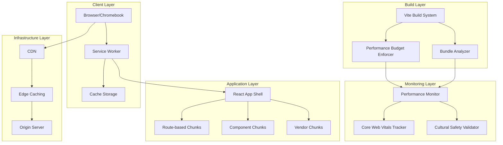
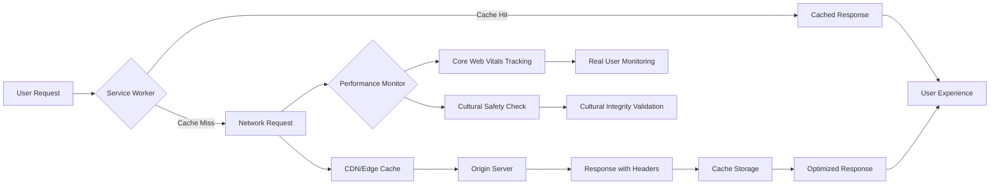
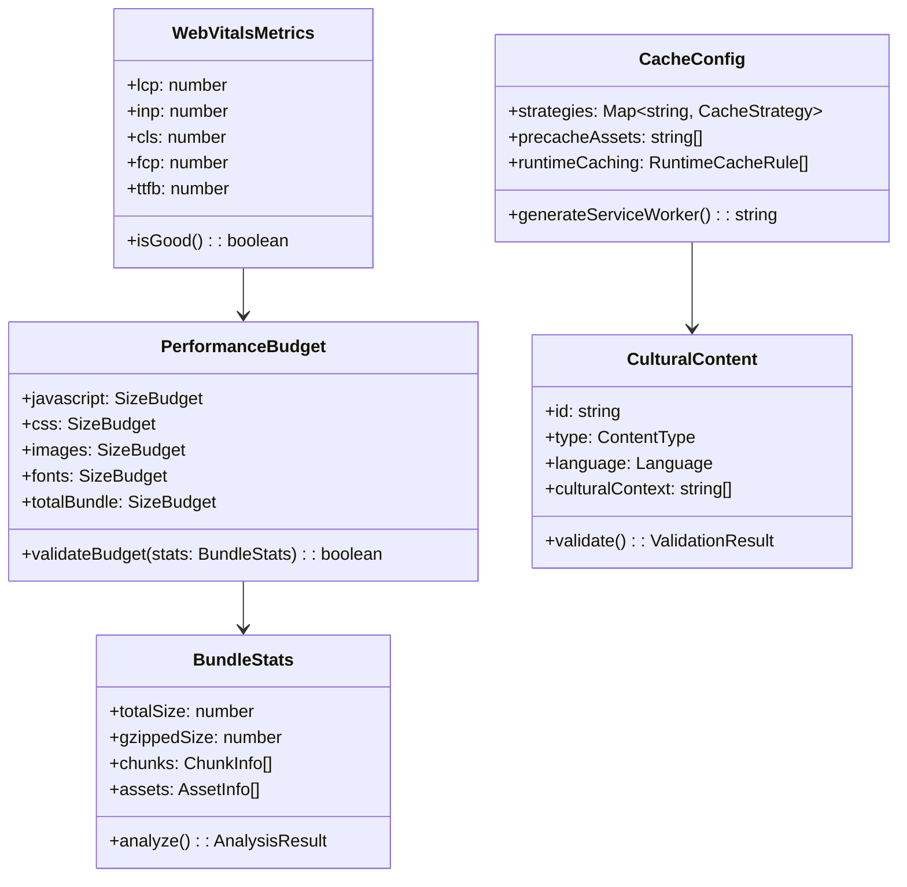
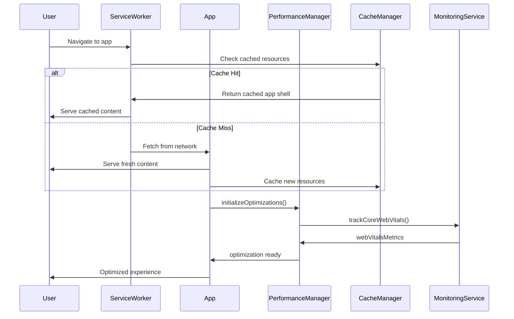
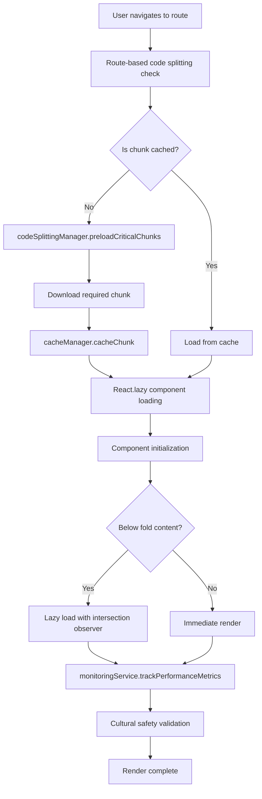
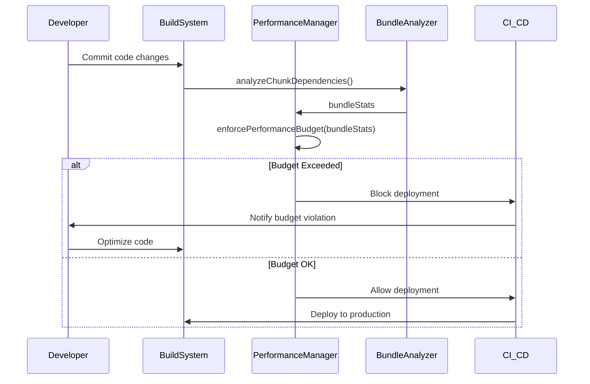
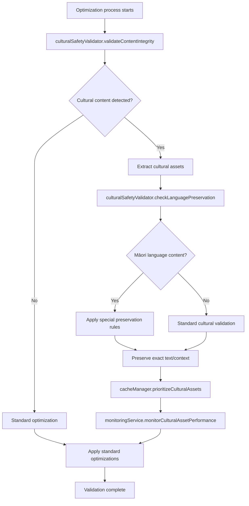
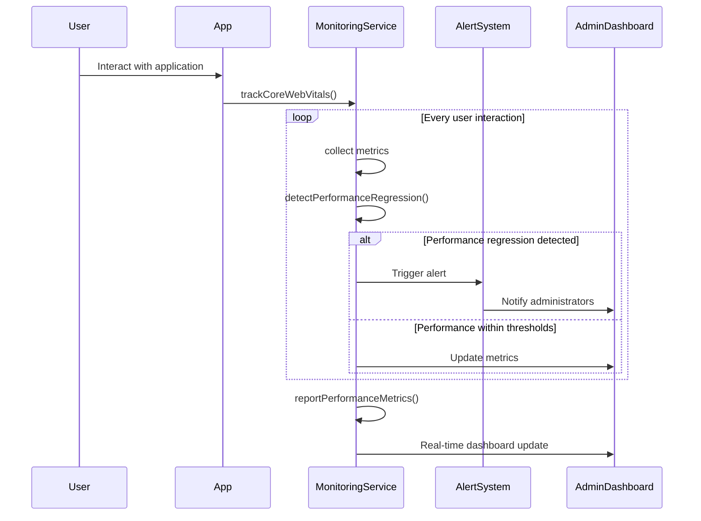

# Performance Optimization Design Document

## Overview

This design document outlines the comprehensive performance optimization strategy for the Great Migration platform, serving 800,000+ students across Aotearoa. The primary objectives are to reduce the current 555KB bundle size to under 500KB while maintaining cultural safety protocols and ensuring optimal performance on Chromebook devices commonly used in New Zealand educational settings.

The optimization strategy encompasses Vite configuration optimization, advanced code splitting, lazy loading implementation, progressive web app features, comprehensive performance monitoring, and robust caching strategies that prioritize educational content and cultural assets.

## Architecture Design

### System Architecture Diagram



### Data Flow Diagram



## Component Design

### PerformanceManager

**Responsibilities:**
- Coordinate all performance optimization strategies
- Monitor bundle size and enforce performance budgets
- Integrate with build pipeline for continuous optimization

**Interfaces:**
```typescript
interface PerformanceManager {
  initializeOptimizations(): Promise<void>;
  enforcePerformanceBudget(bundleStats: BundleStats): boolean;
  trackCoreWebVitals(): void;
  validateCulturalSafety(): Promise<boolean>;
}
```

**Dependencies:**
- BundleAnalyzer
- CacheManager
- MonitoringService
- CulturalSafetyValidator

### CodeSplittingManager

**Responsibilities:**
- Implement route-based and component-based code splitting
- Manage lazy loading strategies
- Optimize chunk distribution for educational content

**Interfaces:**
```typescript
interface CodeSplittingManager {
  configureRouteSplitting(): ViteConfig;
  setupComponentSplitting(): ComponentConfig;
  preloadCriticalChunks(): Promise<void>;
  analyzeChunkDependencies(): ChunkAnalysis;
}
```

**Dependencies:**
- React.lazy
- Vite build configuration
- Route configuration

### CacheManager

**Responsibilities:**
- Implement service worker caching strategies
- Manage cache invalidation and updates
- Prioritize educational and cultural content for caching

**Interfaces:**
```typescript
interface CacheManager {
  registerServiceWorker(): Promise<void>;
  configureCachingStrategies(): CacheConfig;
  invalidateCache(version: string): Promise<void>;
  preloadCriticalAssets(): Promise<void>;
}
```

**Dependencies:**
- Service Worker API
- Cache API
- Asset manifest

### MonitoringService

**Responsibilities:**
- Track Core Web Vitals (LCP, INP, CLS)
- Implement Real User Monitoring (RUM)
- Alert on performance regressions

**Interfaces:**
```typescript
interface MonitoringService {
  initializeRUM(): void;
  trackCoreWebVitals(): WebVitalsMetrics;
  reportPerformanceMetrics(metrics: PerformanceMetrics): Promise<void>;
  detectPerformanceRegression(): boolean;
}
```

**Dependencies:**
- web-vitals library
- Analytics endpoint
- Performance Observer API

### CulturalSafetyValidator

**Responsibilities:**
- Validate cultural content integrity during optimization
- Ensure Māori language content preservation
- Monitor cultural asset performance

**Interfaces:**
```typescript
interface CulturalSafetyValidator {
  validateContentIntegrity(content: CulturalContent): boolean;
  checkLanguagePreservation(text: string): ValidationResult;
  monitorCulturalAssetPerformance(): PerformanceMetrics;
}
```

**Dependencies:**
- Content validation rules
- Language processing utilities
- Cultural asset registry

## Data Model

### Core Data Structure Definitions

```typescript
// Performance Budget Configuration
interface PerformanceBudget {
  javascript: {
    maxSize: number; // 150KB gzipped
    warning: number; // 130KB gzipped
  };
  css: {
    maxSize: number; // 30KB gzipped
    warning: number; // 25KB gzipped
  };
  images: {
    maxSize: number; // 200KB per page
    warning: number; // 180KB per page
  };
  fonts: {
    maxSize: number; // 80KB
    warning: number; // 70KB
  };
  totalBundle: {
    maxSize: number; // 500KB
    warning: number; // 490KB
  };
}

// Bundle Analysis Results
interface BundleStats {
  totalSize: number;
  gzippedSize: number;
  chunks: ChunkInfo[];
  assets: AssetInfo[];
  dependencies: DependencyInfo[];
  treeshakeableModules: string[];
}

interface ChunkInfo {
  name: string;
  size: number;
  gzippedSize: number;
  modules: ModuleInfo[];
  isInitial: boolean;
  isAsync: boolean;
}

// Performance Metrics
interface WebVitalsMetrics {
  lcp: number; // Largest Contentful Paint
  inp: number; // Interaction to Next Paint
  cls: number; // Cumulative Layout Shift
  fcp: number; // First Contentful Paint
  ttfb: number; // Time to First Byte
}

interface PerformanceMetrics {
  webVitals: WebVitalsMetrics;
  bundleSize: number;
  loadTime: number;
  memoryUsage: number;
  networkCondition: NetworkInfo;
  deviceInfo: DeviceInfo;
  timestamp: Date;
}

// Caching Configuration
interface CacheConfig {
  strategies: {
    [key: string]: CacheStrategy;
  };
  precacheAssets: string[];
  runtimeCaching: RuntimeCacheRule[];
  culturalAssets: CulturalAssetConfig[];
}

interface CacheStrategy {
  type: 'CacheFirst' | 'NetworkFirst' | 'StaleWhileRevalidate';
  maxAge: number;
  maxEntries: number;
  patterns: string[];
}

// Cultural Safety Data Model
interface CulturalContent {
  id: string;
  type: 'text' | 'image' | 'audio' | 'video';
  language: 'en' | 'mi' | 'mixed';
  culturalContext: string[];
  validationRules: ValidationRule[];
  integrityHash: string;
}

interface ValidationRule {
  type: 'language' | 'context' | 'respect' | 'accuracy';
  description: string;
  validator: (content: any) => boolean;
}

// Optimization Configuration
interface OptimizationConfig {
  codeSplitting: {
    enableRouteSplitting: boolean;
    enableComponentSplitting: boolean;
    chunkSizeThreshold: number;
    preloadCriticalRoutes: string[];
  };
  lazyLoading: {
    enableImageLazyLoading: boolean;
    enableComponentLazyLoading: boolean;
    intersectionThreshold: number;
    rootMargin: string;
  };
  bundleOptimization: {
    enableTreeShaking: boolean;
    enableMinification: boolean;
    enableCompression: boolean;
    splitVendorChunk: boolean;
  };
}
```

### Data Model Diagrams



## Business Process

### Process 1: Application Initialization with Performance Optimization



### Process 2: Code Splitting and Lazy Loading Implementation



### Process 3: Performance Budget Enforcement



### Process 4: Cultural Safety Preservation During Optimization



### Process 5: Real-time Performance Monitoring and Alerting



## Error Handling Strategy

### Performance Budget Violations

```typescript
class PerformanceBudgetError extends Error {
  constructor(
    public budgetType: string,
    public actualSize: number,
    public limitSize: number
  ) {
    super(`Performance budget exceeded for ${budgetType}: ${actualSize} > ${limitSize}`);
  }
}

// Error handling in build process
try {
  const isWithinBudget = performanceManager.enforcePerformanceBudget(bundleStats);
  if (!isWithinBudget) {
    throw new PerformanceBudgetError('totalBundle', bundleStats.totalSize, 500000);
  }
} catch (error) {
  if (error instanceof PerformanceBudgetError) {
    // Block deployment and provide optimization suggestions
    buildSystem.blockDeployment();
    buildSystem.provideBudgetOptimizationSuggestions(error);
  }
}
```

### Service Worker Failures

```typescript
class ServiceWorkerError extends Error {
  constructor(public operation: string, public originalError: Error) {
    super(`Service Worker operation failed: ${operation}`);
  }
}

// Graceful degradation for service worker failures
try {
  await cacheManager.registerServiceWorker();
} catch (error) {
  console.warn('Service Worker registration failed, falling back to network-only mode');
  // Application continues to function without caching
  monitoringService.reportError(new ServiceWorkerError('registration', error));
}
```

### Cultural Safety Validation Failures

```typescript
class CulturalSafetyError extends Error {
  constructor(
    public contentId: string,
    public validationType: string,
    public details: string
  ) {
    super(`Cultural safety validation failed for ${contentId}: ${details}`);
  }
}

// Strict validation for cultural content
try {
  const isValid = culturalSafetyValidator.validateContentIntegrity(culturalContent);
  if (!isValid) {
    throw new CulturalSafetyError(
      culturalContent.id,
      'integrity',
      'Content modification detected'
    );
  }
} catch (error) {
  if (error instanceof CulturalSafetyError) {
    // Halt optimization and restore original content
    optimizationProcess.halt();
    contentManager.restoreOriginalContent(error.contentId);
    alertSystem.notifyCulturalSafetyTeam(error);
  }
}
```

### Network Resilience Error Handling

```typescript
class NetworkResilienceManager {
  async handleNetworkError(error: Error, retryCount: number = 0): Promise<Response | null> {
    const maxRetries = 3;
    const backoffDelay = Math.pow(2, retryCount) * 1000; // Exponential backoff
    
    if (retryCount < maxRetries) {
      await new Promise(resolve => setTimeout(resolve, backoffDelay));
      return this.retryRequest(retryCount + 1);
    }
    
    // After all retries failed, check for cached content
    const cachedResponse = await cacheManager.getCachedResponse();
    if (cachedResponse) {
      monitoringService.reportOfflineMode();
      return cachedResponse;
    }
    
    // Show offline message if no cached content available
    uiManager.showOfflineMessage();
    return null;
  }
}
```

## Testing Strategy

### Performance Testing Framework

```typescript
interface PerformanceTestSuite {
  // Bundle size testing
  testBundleSizeCompliance(): Promise<TestResult>;
  testCodeSplittingEffectiveness(): Promise<TestResult>;
  testTreeShakingOptimization(): Promise<TestResult>;
  
  // Core Web Vitals testing
  testLCPPerformance(deviceType: DeviceType): Promise<TestResult>;
  testINPResponsiveness(): Promise<TestResult>;
  testCLSStability(): Promise<TestResult>;
  
  // Cultural safety testing
  testCulturalContentIntegrity(): Promise<TestResult>;
  testMāoriLanguagePreservation(): Promise<TestResult>;
  
  // Caching strategy testing
  testServiceWorkerCaching(): Promise<TestResult>;
  testOfflineFunctionality(): Promise<TestResult>;
  
  // Network resilience testing
  testSlowNetworkPerformance(): Promise<TestResult>;
  testIntermittentConnectivityHandling(): Promise<TestResult>;
}
```

### Automated Performance Monitoring

```typescript
class ContinuousPerformanceMonitoring {
  async runLighthouseAudits(): Promise<LighthouseResults> {
    // Automated Lighthouse audits on every build
    const audit = new LighthouseAudit({
      deviceType: 'mobile',
      networkCondition: '3G',
      performanceBudget: this.performanceBudget
    });
    
    return audit.run();
  }
  
  async validatePerformanceBudgets(): Promise<BudgetValidationResult> {
    const bundleStats = await bundleAnalyzer.analyze();
    const isCompliant = performanceManager.enforcePerformanceBudget(bundleStats);
    
    if (!isCompliant) {
      throw new PerformanceBudgetError('Automated validation failed');
    }
    
    return { compliant: true, stats: bundleStats };
  }
}
```

This comprehensive design addresses all requirements while ensuring cultural safety preservation, optimal Chromebook performance, and robust monitoring capabilities. The architecture leverages modern web performance techniques while maintaining the educational platform's core values and accessibility requirements.