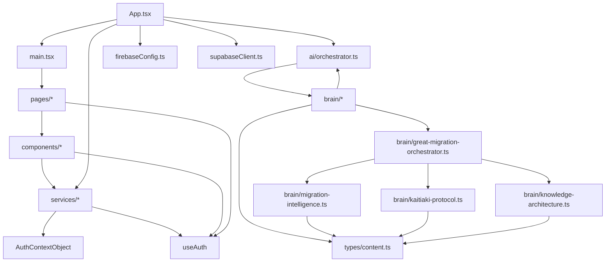

# Codebase Breadcrumbs & Graphs

This document provides breadcrumbs and a high-level graph of the codebase for future agents. Use this as a navigation and provenance guide.

---

## Directory Structure

- **src/components/**
  - UI components: `Button`, `Card`, `Footer`, `Hero`, `Home`, `Login`, `Navbar`, `PrivateRoute`, `SignUp`, `BrainNavigation`
- **src/pages/**
  - Page-level views: `Home`, `StyleGuide`, `TeacherDashboard`
- **src/services/**
  - Auth context and hooks: `AuthContext.tsx`, `AuthContextObject.tsx`, `useAuth.ts`
- **src/brain/**
  - Agentic logic, migration, knowledge: `great-migration-orchestrator.ts`, `kaitiaki-protocol.ts`, `knowledge-architecture.ts`, `migration-intelligence.ts`
- **src/ai/**
  - Orchestration: `orchestrator.ts`
- **src/types/**
  - Shared types: `content.ts`
- **src/**
  - App entry: `main.tsx`, `App.tsx`, `firebaseConfig.ts`, `supabaseClient.ts`, `vite-env.d.ts`

---

## Codebase Graph (Module Relationships)

---

## Breadcrumbs for Agents

- **Auth Flow:**
  - `useAuth.ts` (hook) ← `AuthContextObject.tsx` (context) ← used by components/pages
- **Agentic Orchestration:**
  - `ai/orchestrator.ts` → `brain/*` (migration, knowledge, protocol)
- **UI Navigation:**
  - `BrainNavigation.tsx` (breadcrumbs, memory)
- **Migration Intelligence:**
  - `great-migration-orchestrator.ts`, `migration-intelligence.ts`, `knowledge-architecture.ts`, `kaitiaki-protocol.ts`
- **Shared Types:**
  - `types/content.ts` (used by brain/*)

---

## How to Extend

- Add new agents/modules in `src/brain/` or `src/ai/`.
- UI components go in `src/components/`.
- Page-level views in `src/pages/`.
- Shared types in `src/types/`.
- Auth logic in `src/services/`.

---

## Provenance & Collaboration

- Update this file with new breadcrumbs and graph nodes as the codebase evolves.
- Use this as a living map for agentic collaboration and migration provenance.
