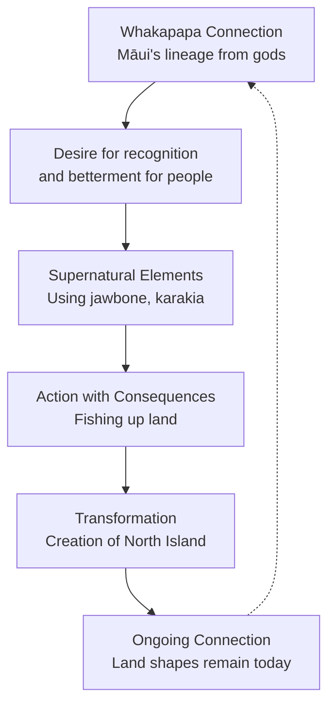

# Narrative Structure in Māori Pūrākau
*He kākano ahau i ruia mai i Rangiātea*  
(I am a seed sown from Rangiātea)

## He Whakamārama | Understanding Our Focus

**Big Idea:** Pūrākau aren't just stories - they're living patterns of knowledge that connect us to our past, present, and future. Today we're learning how these patterns work and why they matter.

**Why This Matters:** Understanding pūrākau structure helps us see how Māori worldview shapes storytelling, which helps us understand ourselves and our place in Aotearoa better.

---

## Previous Learning Connections

*Remember when we learned about...*
- **Whakapapa** (genealogical connections) in Social Studies
- **Patterns and sequences** in Mathematics
- **Beginning-Middle-End** in basic story writing
- **Māori creation stories** and their importance

*Today we're building on that by...*
- Seeing how whakapapa shapes story structure
- Discovering deeper patterns than simple sequence
- Understanding WHY stories are structured this way
- Connecting structure to Māori worldview

---

## Deep Investigation: The Living Patterns of Pūrākau

### Core Concept: Pūrākau Follow Whakapapa Patterns

Unlike linear Western stories, pūrākau often flow in **spiral patterns** that connect across time and generations.

**Key Structural Elements:**

1. **Timatanga** (Beginning)
   - Establishes whakapapa connections
   - Sets the mauri (life force) of the story
   - Often starts with genealogical references

2. **Tūāoma** (The Unfolding)
   - Multiple layers of action and meaning
   - Events connected through cause and effect
   - Teaches values and lessons

3. **Whakamutunga** (Conclusion)
   - Often circular rather than final
   - Leaves connections for future stories
   - Reinforces the mauri of the narrative

### Activity: Mapping the Spiral of Māui

Let's trace the structure of Māui's fishing up Te Ika a Māui:

**Deep Thinking Questions:**
- Why does the story start with Māui's whakapapa rather than his actions?
- How does the "ending" connect back to our lives today?
- What values is this structure teaching us?

---

## Cultural Wisdom Connections

### The Deeper Patterns

**Whakapapa as Structure:**
Māori stories often follow genealogical patterns because everything is understood through relationships and connections.

**Circular Time:**
Unlike Western linear time (past → present → future), Māori time is often understood as a spiral where past, present and future connect.

**Interconnectedness:**
Events in pūrākau aren't isolated - they connect to people, places, and other stories.

**Kaitiakitanga:**
Story structure often teaches our responsibilities and relationships with the natural world.

---

## Transfer Challenges

### Apply Your Understanding Across Contexts

**Challenge 1: Modern Story Analysis**
Find the pūrākau patterns in a modern film or book (like Moana or Whale Rider). Where do you see:
- Whakapapa connections?
- Spiral patterns?
- Interconnected events?

**Challenge 2: Personal Narrative**
Structure a story from your own life using pūrākau patterns:
- Start with your whakapapa (where you come from)
- Show how events connect and relate
- Create a meaningful conclusion that circles back

**Challenge 3: Cross-Cultural Comparison**
Compare the structure of a pūrākau with a European fairy tale. What do the different structures tell us about different worldviews?

---

## Future Learning Pathways

*Where this understanding will take us:*

**Year 8:** Deeper analysis of specific pūrākau types and their regional variations

**Year 9:** Comparative mythology - analyzing story structures across cultures

**Year 10:** Creating original narratives using Māori storytelling principles

**Senior Years:** Literary analysis of Māori literature and film using structural understanding

**Beyond School:** Understanding how cultural narratives shape our national identity and personal worldview

---

## Assessment: Understanding Transfer

*Show you can apply this understanding:*

**Task:** Choose either a personal experience or a known story and recreate it using pūrākau structural principles.

**Success Looks Like:**
- Using whakapapa connections appropriately
- Demonstrating spiral rather than linear structure
- Showing interconnectedness of events
- Communicating cultural values through structure
- Explaining WHY you structured it this way

**Deep Extension:** Write a reflection comparing this structure to Western narrative styles and what each approach emphasizes.

---

## He Kupu Whakamutunga | Final Word

Remember: understanding pūrākau structure isn't about memorizing patterns - it's about understanding how Māori see the world as interconnected, relational, and spiraling through time. This understanding will help you not just with stories, but with understanding our culture and our place in it.

*Kia hora te marino*  
*Kia whakapapa pounamu te moana*  
*Kia tere te kārohirohi i mua i tō huarahi*  
May peace be widespread  
May the sea be like greenstone  
May the shimmer of light guide your path

---
*This content has been developed in consultation with Māori educational specialists and aligns with Te Mātaiaho | the Refreshed NZ Curriculum. Cultural elements should be reviewed by kaitiaki Māori before widespread use.*